# The Hiring Hack

Objective : the HIRING HACK is a one-stop solution to your endless intern hunts. We aim to provide a platform to bridge big companies and start-ups offering internship roles, to the college students.

**[Join Us Now](https://#)**

 
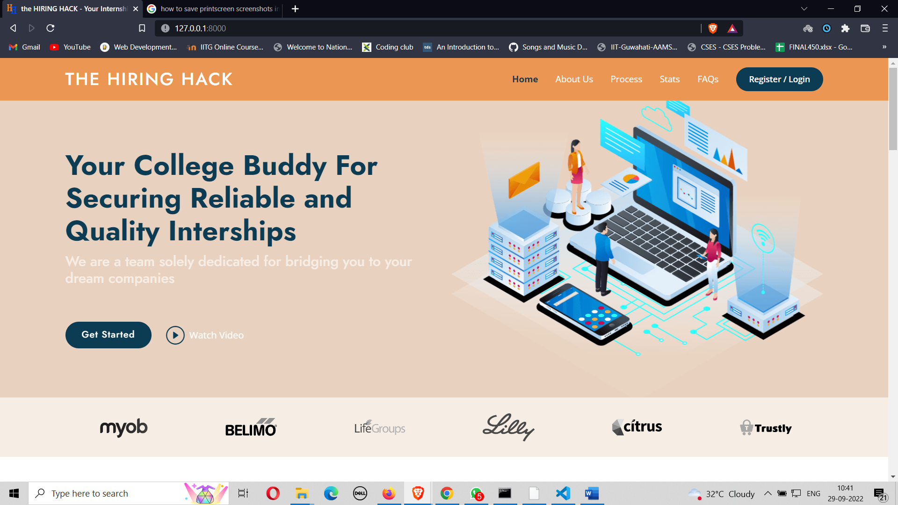

# Stack

- Django
- Bootstrap
- EJS
- HTML
- CSS
- Javascript
- DB SQLite

# Functionalities

Let's start with listing out the functionalities of the platform and how it can be used by companies and students alike :

## 1. Authentication

The first step for both the company and the student involves registering :

### 1.1 Company Registration

- Company Registration requires the representative of the company to fill out the following fields : **Representative's Name**, **Representative's Email ID**, **Company's Name**, **Representative's Contact**, **Company's Logo** , **Password** .

 
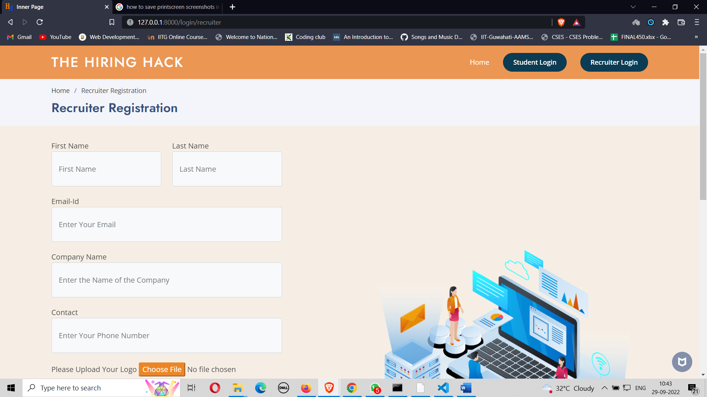
 
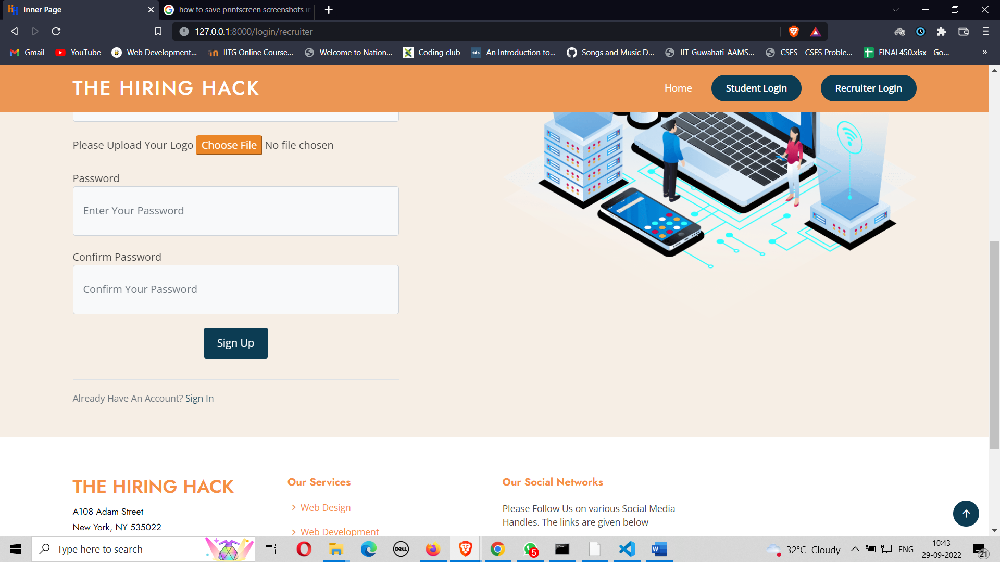

### 1.2 Student Registration

- Student Registration requires the student to fill outthe following fields: **Student's Name**, **Student's Email ID**, **Gender**, **Password** .

 
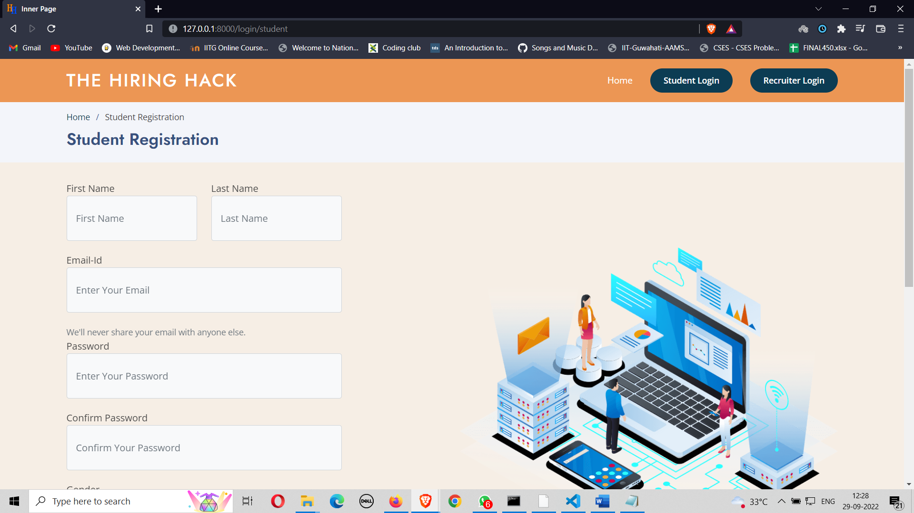

### 1.3 Sign In

- Both Recruiter SignIn and Student SignIn requires the registered Email ID and the password.
- If entered correctly, you will be authenticated into your account.
- Else, a pop-up "Incorrect Credentials" appears.

## 2. Recruiter-Side

Let's look at the features available to the recruiter :

### 2.1 Post-Login : Home Page

The home page shows the company's logo along with the details that the representative had entered while registering. These details can be updated by the company.

 
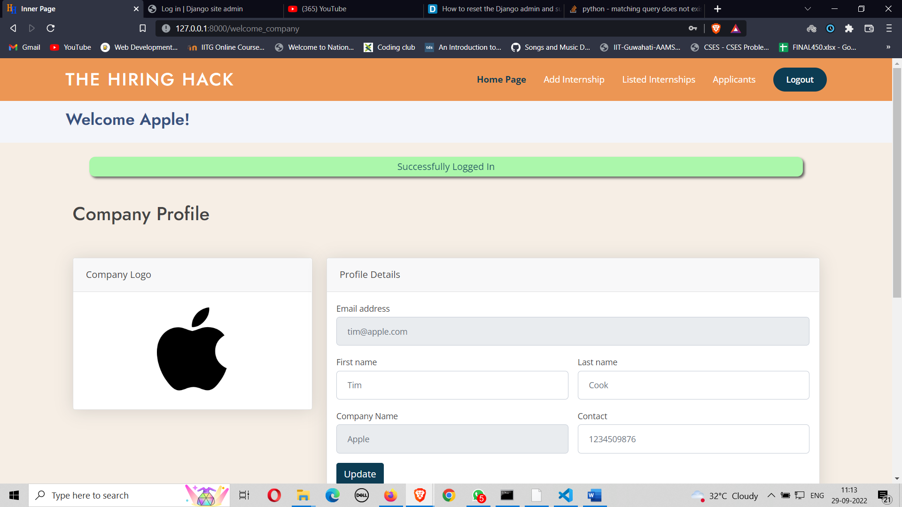

### 2.2 Add Internship

- This page allows the recruiter to add the internship role.
- Fields include - **Internship Title**, **Start Date**, **End Date**, **Application Deadline**, **Job Profile **, **Skills Required**, **Eligibility Criteria**, **Stipend (per month)**, **Location**, **Internship Description**,

> Note : The application Deadline should be earlier than the Start Date and End Date and
> the Start Date should be earlier than the End Date.
  > 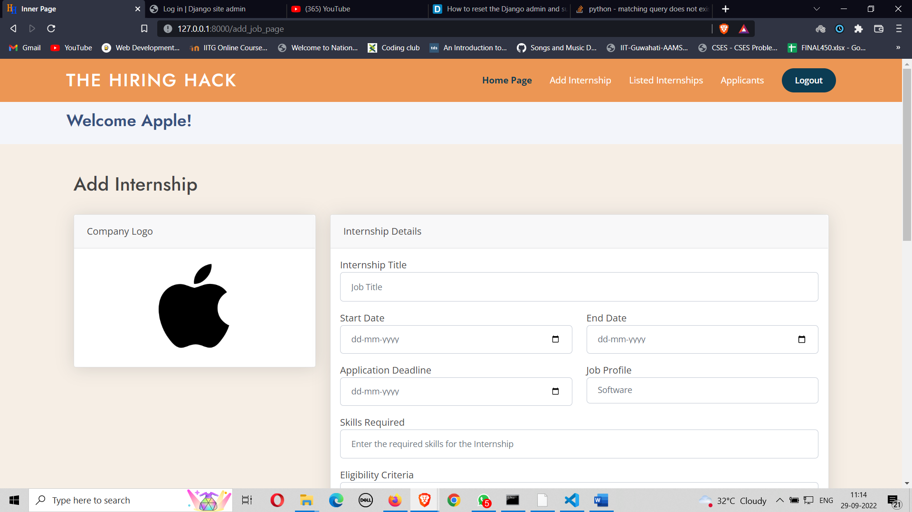   > 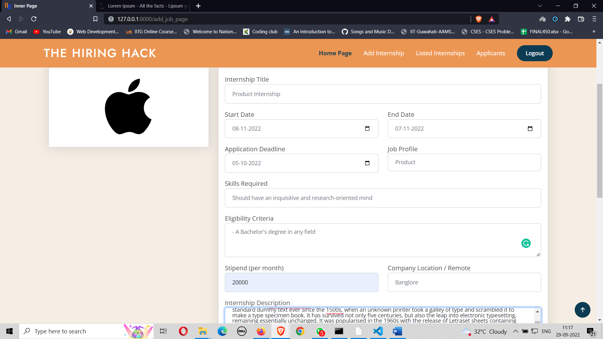

### 2.3 Listed Internships

- Lists out the Internship Roles that the company has opened up.
- **Edit Functionality** : Allows the company to edit the Internship Details
- **Delete Functionality** : Allows the company to delete any role which they are no longer looking interns for.

 
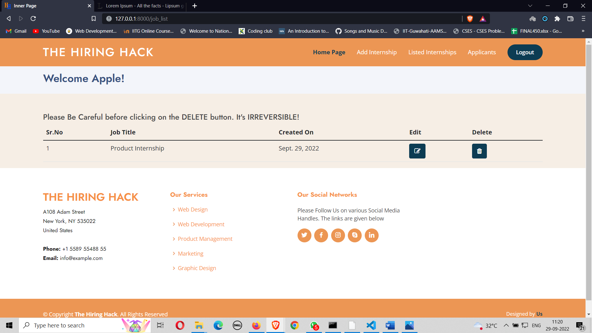

### 2.4 Applicants

- The recruiter can check out the applicants who have applied for any of their roles.
- The applicants are sorted as per the roles, meaning all applicants for a particular role come together followed by applicants for other roles.
- The recruiter can check out the resumes of each of the applicant before moving onto the next step.
- The recruiter may choose to appropriately manage the status of each applicant - **Under Process**, **Shortlisted**, **Selected** and **Rejected**.

 
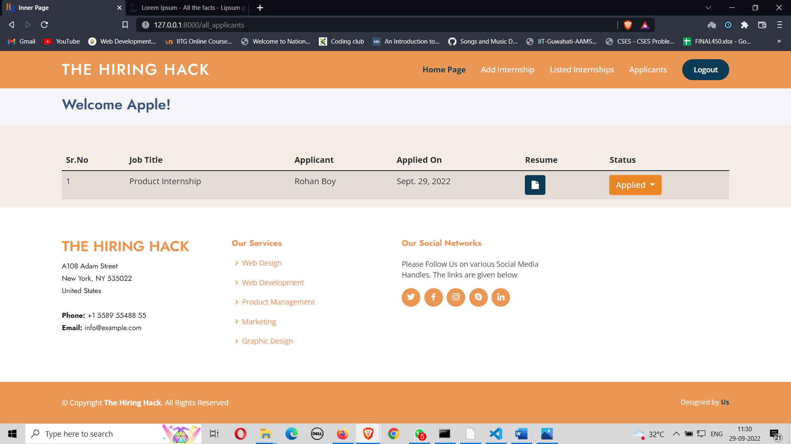
 
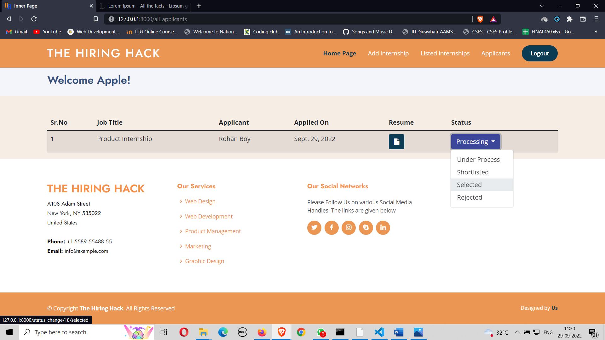

## 3. Student Side

### 3.1 Post-Login : Profile Page

- Right after the student logs in, he/ she is taken to the Update Profile Page where he/she is required to enter/update all of their necessary information like - **Name**, **College**, **Department**, **Current Year of Study**, **Contact**, **Date of Birth**, **Profile Photo**, **Add Resume**,
- Once they update their profiles, their profile photo and their resume is shown on the left panel for them to verify or update them as and when required.

 
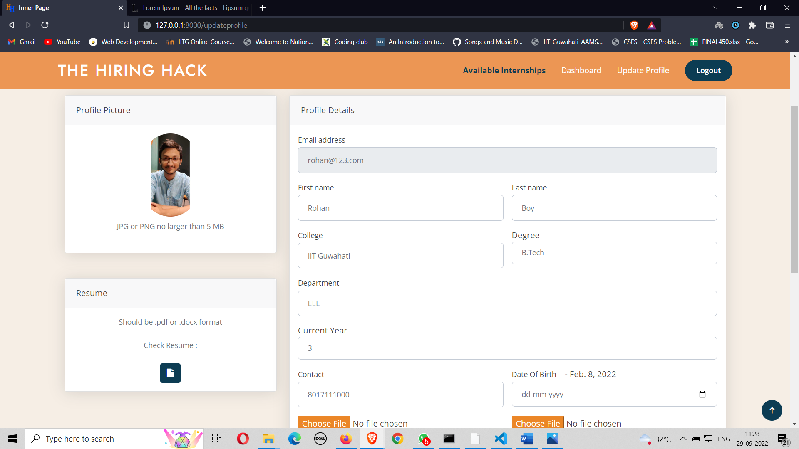

### 3.2 Available Internships

- This page displays all the available internships offered by various companies on the platform.
- Each Internship Role card displays the following : **Company Logo**, **Company Name**, **Posted Date**, **Job Profile**, **Internship Title** and **Application Deadline**.
- Clicking on any one of the cards opens up the internship details page for that particular role.

 
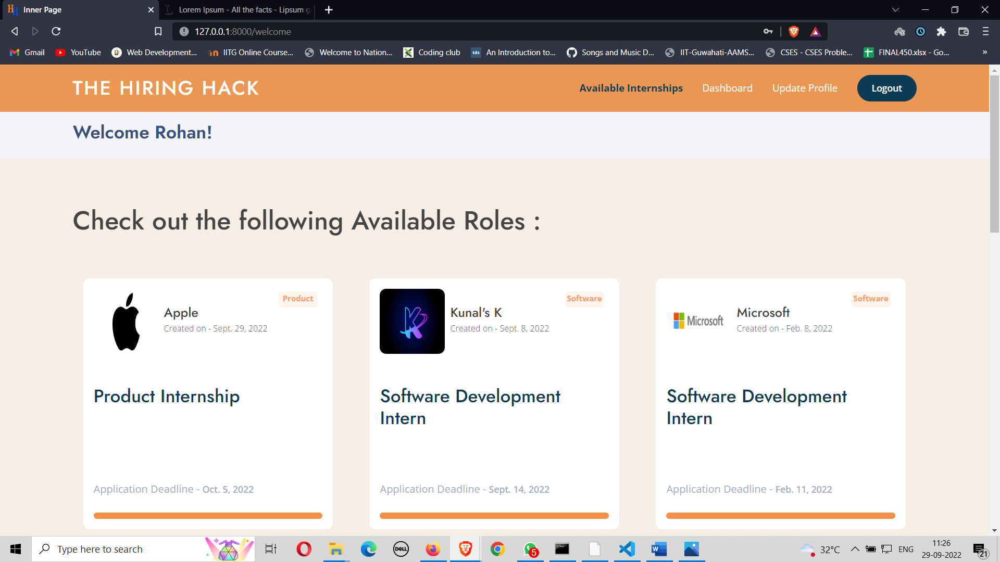

### 3.3 Internship Details

- Has the Internship Details along with the ** Apply ** button.
- If the student is within the application deadline and is eligible, he/she can apply for the role by clicking on the apply button.
- The resume of the candidate directly goes to the company and they can then decide what to do with the particular applicant.

 
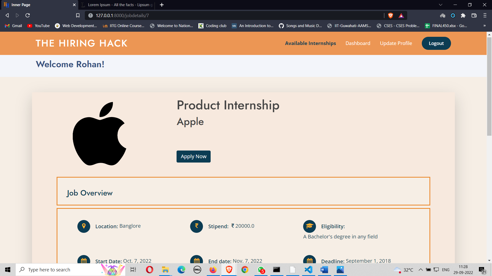
 
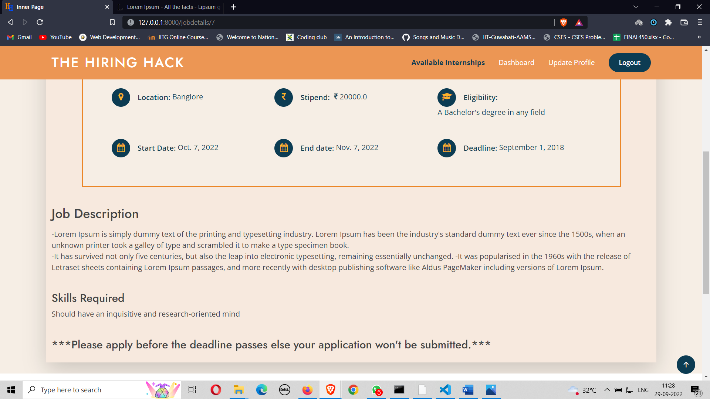

### 3.4 Dashboard

- Students can track all their applications here. - Their statuses are visible for each of the roles.

 
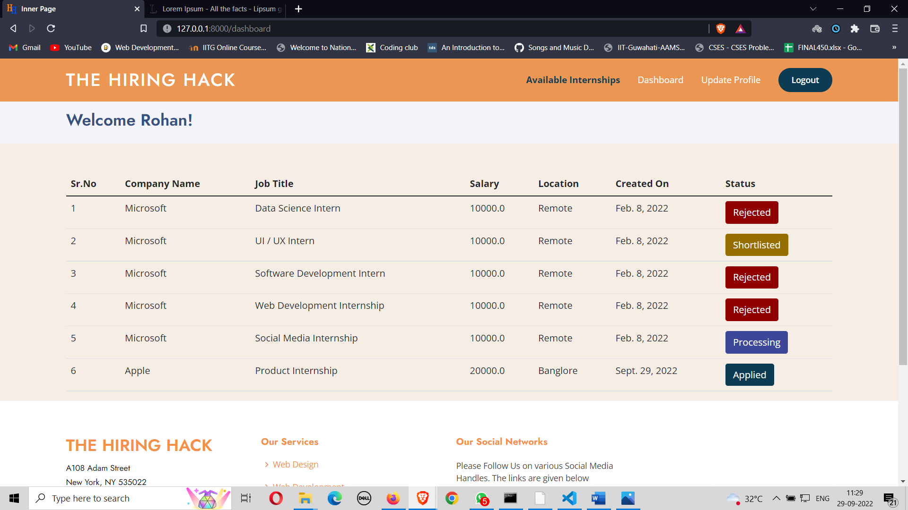

# Folder Structure

1. Marks1st - Django server side code, primarily settings.py
2. Gallery - Project Snippets
3. Login - Django server-side code related to Authentication
4. Home - Django server side code and with all model schemas - Applicant, Company, Job and an Application.
5. Static - Static components like images, CSS, JS, company logos, resumes and profile pictures.
6. Templates - HTML, Bootstrap and EJS written Client Side Code.

# User flow and plans

Used Whimiscal to lay the basic user flow in the beginning and then used Trello to follow through with the plan

1. Trello
2. Whimsical

# For more snaps

You can go to the Gallery Folder and have a look at more snapshots of the project. **[Gallery](https://github.com/Gourav2K/The-Hiring-Hack/tree/main/gallery)**

**Thank You!**
